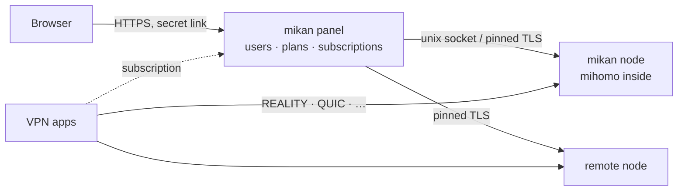

<div align="center">

<picture>
  <source media="(prefers-color-scheme: dark)" srcset=".github/assets/banner-en-dark.svg">
  
</picture>

<br>

**Un panel VPN rápido y bonito sobre el núcleo [mihomo](https://github.com/MetaCubeX/mihomo): se instala con un solo comando y no hay que vigilarlo.**

[](https://github.com/Miroshka000/mikan/releases)
[](https://github.com/Miroshka000/mikan/pkgs/container/mikan)
[](LICENSE)
[](https://github.com/MetaCubeX/mihomo)
[](https://t.me/mikanvpn)
[](https://t.me/+I2JFR7DbPow1ZmQy)

[English](README.md) · [Русский](README.ru.md) · [简体中文](README.zh-CN.md) · [فارسی](README.fa.md) · [Türkçe](README.tr.md) · **Español**

</div>

---

## Instalación

En un servidor nuevo con Ubuntu 22.04+ o Debian 12+ (amd64 o arm64):

```bash
curl -fsSL https://github.com/Miroshka000/mikan/releases/latest/download/install.sh | sudo bash
```

El instalador pregunta el idioma del panel y un dominio opcional, comprueba que el dominio apunte al servidor, instala Docker si hace falta, elige sitios de camuflaje REALITY cerca de tu servidor e imprime tu enlace de administrador. Ejecuta `mikan` de nuevo en cualquier momento para abrir el menú de gestión.

Para añadir un nodo a un panel existente: la página **Nodos** del panel (o `mikan node add`) te da el comando con su clave:

```bash
curl -fsSL https://github.com/Miroshka000/mikan/releases/latest/download/install.sh | sudo bash -s -- --join KEY
```

Sin preguntas, para scripts: `… | sudo bash -s -- --yes --lang en --domain vpn.example.com --email you@example.com` (todos los parámetros: `mikan install --help`).

## Por qué mikan

<table>
<tr>
<td width="50%" valign="top">

### 🛡️ Sobrevive a los bloqueos por sí solo
mikan comprueba si los clientes reales siguen llegando a cada protocolo. Cuando un puerto se bloquea por el camino, mueve el protocolo a un puerto HTTPS libre; cuando un sitio de camuflaje REALITY deja de funcionar, elige uno nuevo cerca de tu servidor.

</td>
<td width="50%" valign="top">

### 📱 Cada app recibe lo que puede usar
Las suscripciones detectan la app (Happ, v2RayTun, Koala Clash, SlothClash, Clash Verge, FlClash, ClashFest, Hiddify, Shadowrocket y más) y le entregan solo los protocolos que realmente admite. Se acabó el «a mí no me funciona».

</td>
</tr>
<tr>
<td valign="top">

### 📊 Contabilidad exacta al byte
mihomo está integrado como biblioteca, así que el tráfico se cuenta por usuario en cada conexión, sin muestreo. Planes por tiempo y por gigabytes, días de facturación, límites de dispositivos y vinculación de dispositivos contra el uso compartido de claves.

</td>
<td valign="top">

### 🤖 Bot de Telegram y Mini App incluidos
Los suscriptores consultan su plan, sus dispositivos y las guías de conexión en un bot que configuras en el panel, abren la página de suscripción como Mini App de Telegram y reciben un aviso antes de que venza. También pueden comprar y renovar: Telegram Stars, tarjetas y SBP a través de YooKassa, o criptomonedas con CryptoBot. El panel entrega el enlace por sí mismo. Los envíos masivos respetan los límites de Telegram.

</td>
</tr>
<tr>
<td valign="top">

### 🪶 Ligero como una mandarina
Go y PostgreSQL, tres contenedores pequeños. En un servidor en funcionamiento con clientes: **~14 MB de RAM** para el panel, **~50 MB** para la base de datos, **~40 MB** para el núcleo VPN.

</td>
<td valign="top">

### 🔒 Blindado por defecto
Enlace de administrador secreto en un puerto aleatorio, HTTPS con Let's Encrypt (incluso para una IP sin dominio), argon2id, 2FA con TOTP, protección CSRF, CSP estricta, registro de auditoría. Los contenedores se ejecutan sin root, en solo lectura y sin ninguna capability.

</td>
</tr>
<tr>
<td valign="top">

### 🌐 WARP y cascadas de servidores
Cada nodo puede tener su propio WARP, registrado con un clic o a partir de tu configuración de WireGuard, y los protocolos pueden salir por otro nodo del panel (cliente → nodo A → nodo B → internet). Los protocolos, dominios y redes elegidos toman esas salidas; todo lo demás va directo.

</td>
<td valign="top">

### 🧩 API y claves para integraciones
Una API REST documentada en el propio panel, con claves de solo lectura o de acceso completo para bots, facturación y monitorización.

</td>
</tr>
</table>

## Códigos promocionales

Los administradores pueden crear códigos de descuento y códigos de días o tráfico de
bonificación. Los suscriptores aplican los códigos en la Mini App de Telegram, que además
muestra su historial de canjes. El tráfico de bonificación puede ir al saldo principal o a
un pool elegido. Las facturas con descuento solo están disponibles con métodos de pago que
admiten reembolsos: Telegram Stars y los adaptadores que declaran soporte de reembolsos.
Así, Mikan puede devolver un pago si la reserva del código vence antes de que el proveedor
lo confirme.

## Capturas de pantalla

<table>
<tr>
<td width="50%"></td>
<td width="50%"></td>
</tr>
<tr>
<td></td>
<td></td>
</tr>
</table>

<p align="center">

&nbsp;&nbsp;

</p>

## Protocolos

Diecisiete protocolos, cada uno un preset con las claves generadas por ti. La suscripción da a cada app solo lo que ejecuta:

| Protocolo | Apps Clash<br><sub>núcleo mihomo</sub> | Apps Xray<br><sub>Happ, v2RayTun</sub> | Apps sing-box<br><sub>Hiddify, Karing</sub> |
|---|:---:|:---:|:---:|
| VLESS · REALITY · Vision | ✅ | ✅ | ✅ |
| VLESS · REALITY · XHTTP | ✅ | ✅ | — |
| VLESS · REALITY · gRPC | ✅ | ✅ | ✅ |
| VLESS PQ (cifrado poscuántico) | ✅ | ✅ | — |
| Trojan · REALITY | ✅ | ✅ | ✅ |
| VLESS · TLS · XHTTP | ✅ | ✅ | — |
| VLESS · TLS · Vision | ✅ | ✅ | ✅ |
| Hysteria2 | ✅ | ✅ | ✅ |
| TUIC v5 | ✅ | — | ✅ |
| AnyTLS | ✅ | — | ✅ |
| TrustTunnel | ✅ | — | — |
| ShadowQUIC | ✅ | — | — |
| Mieru | ✅ | — | — |
| Shadowsocks-2022 ¹ | ✅ | ✅ | ✅ |
| Sudoku ¹ | ✅ | — | — |
| Snell ¹ | ✅ | — | — |
| VMess (configuración propia) | ✅ | ✅ | ✅ |

<sub>¹ Una sola clave para todos los usuarios en mihomo: en estos protocolos no hay contabilidad ni límites por usuario. Los protocolos más nuevos se envían a las apps Clash solo cuando su núcleo es lo bastante reciente.</sub>

## Cómo funciona



El panel y el nodo son dos procesos de una misma imagen. Actualiza o reinicia el panel y la VPN sigue funcionando. Añade nodos remotos con una clave de unión desde la página **Nodos**.

## Gestión del servidor

Ejecuta `mikan` para abrir el menú, o usa los comandos directamente:

| Comando | Qué hace |
|---|---|
| `mikan status` | contenedores, versiones, estado de salud, actualización disponible |
| `mikan logs [panel\|node]` | registros en vivo |
| `mikan url` | enlace de administrador |
| `mikan reset-password` · `reset-path` · `disable-2fa` | recuperar el acceso |
| `mikan update` | actualizar ahora (copia de seguridad antes, reversión automática) |
| `mikan backup` · `restore FILE` | copias de seguridad en `/opt/mikan/backups` |
| `mikan node …` · `mikan inbound …` | nodos y protocolos |
| `mikan targets scan` · `apply` | sitios de camuflaje REALITY cerca del servidor |
| `mikan join KEY` | en un nodo: tomar una clave nueva del panel |
| `mikan restart` | reiniciar los contenedores |
| `mikan uninstall` | detener y quitar el comando, conservando los datos |

## Actualizaciones

El panel busca una versión nueva una vez al día y muestra qué ha cambiado. Activa la **actualización automática** en los ajustes, o pulsa **Actualizar**: el actualizador del host descarga la imagen de GitHub Packages, hace una copia de seguridad, migra la base de datos, reinicia y revierte si la versión nueva no arranca en buen estado. Cada manifiesto de versión está firmado.

Si estás en la 0.4.4 o anterior, actualiza primero a la 0.4.5; el paso a la 0.5 y a PostgreSQL llega después también con el botón Actualizar. Si te saltaste la 0.4.5, el comando de instalación de arriba actualiza un servidor existente.

## Compilar desde el código fuente

```bash
docker buildx build -t mikan:dev .            # panel + node image
cd web && pnpm install && pnpm dev            # admin UI with hot reload
MIKAN_TEST_DATABASE_URL=postgres://… go test ./...   # Go 1.27, a test PostgreSQL 18 and pg_dump
cd installer && cargo test                    # the installer (Rust)
```

El desarrollo se hace en la rama `dev`; los pull requests hacia `main` se compilan y se prueban, y las versiones se publican a partir de etiquetas.

## Licencia

mikan es software libre bajo la [GNU GPL v3](LICENSE). Incluye [mihomo](https://github.com/MetaCubeX/mihomo) (GPL-3.0). Fuentes: Unbounded, Onest, JetBrains Mono (SIL OFL 1.1).

<div align="center">
<sub>Hecho con 🍊</sub>
</div>
