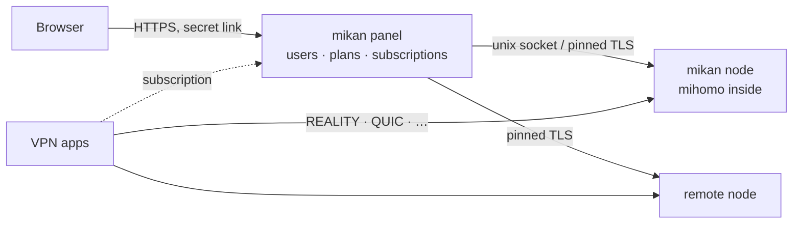

<div align="center">

<picture>
  <source media="(prefers-color-scheme: dark)" srcset=".github/assets/banner-en-dark.svg">
  
</picture>

<br>

<div dir="rtl">

**یک پنل VPN سریع و زیبا روی هستهٔ [mihomo](https://github.com/MetaCubeX/mihomo): با یک دستور نصب می‌شود و نیازی به مراقبت ندارد.**

</div>

[](https://github.com/Miroshka000/mikan/releases)
[](https://github.com/Miroshka000/mikan/pkgs/container/mikan)
[](LICENSE)
[](https://github.com/MetaCubeX/mihomo)
[](https://t.me/mikanvpn)
[](https://t.me/+I2JFR7DbPow1ZmQy)

[English](README.md) · [Русский](README.ru.md) · [简体中文](README.zh-CN.md) · **فارسی** · [Türkçe](README.tr.md) · [Español](README.es.md)

</div>

---

<div dir="rtl">

## نصب

روی یک سرور تازهٔ Ubuntu 22.04 یا بالاتر، یا Debian 12 یا بالاتر (با معماری amd64 یا arm64):

</div>

```bash
curl -fsSL https://github.com/Miroshka000/mikan/releases/latest/download/install.sh | sudo bash
```

<div dir="rtl">

نصب‌کننده زبان پنل و یک دامنهٔ اختیاری را می‌پرسد، بررسی می‌کند که دامنه به سرور اشاره کند، در صورت نیاز Docker را نصب می‌کند، نزدیک سرور شما سایت‌های استتار REALITY را انتخاب می‌کند و لینک مدیر شما را چاپ می‌کند. هر زمان `mikan` را دوباره اجرا کنید تا منوی مدیریت باز شود.

برای افزودن نود به یک پنل موجود: صفحهٔ **نودها** در پنل (یا `mikan node add`) دستور را همراه با کلیدش می‌دهد:

</div>

```bash
curl -fsSL https://github.com/Miroshka000/mikan/releases/latest/download/install.sh | sudo bash -s -- --join KEY
```

<div dir="rtl">

بدون پرسش، برای اسکریپت‌ها: `… | sudo bash -s -- --yes --lang en --domain vpn.example.com --email you@example.com` (همهٔ پرچم‌ها: `mikan install --help`).

## چرا mikan

</div>

<table dir="rtl">
<tr>
<td width="50%" valign="top">

### 🛡️ خودش در برابر مسدودسازی دوام می‌آورد
mikan بررسی می‌کند که کلاینت‌های واقعی هنوز به هر پروتکل می‌رسند یا نه. وقتی پورتی در مسیر مسدود شود، پروتکل را به یک پورت HTTPS آزاد منتقل می‌کند؛ وقتی یک سایت استتار REALITY از کار بیفتد، سایت جدیدی نزدیک سرور شما انتخاب می‌کند.

</td>
<td width="50%" valign="top">

### 📱 هر برنامه همان چیزی را می‌گیرد که می‌تواند استفاده کند
اشتراک‌ها برنامه را تشخیص می‌دهند (Happ، v2RayTun، Koala Clash، SlothClash، Clash Verge، FlClash، ClashFest، Hiddify، Shadowrocket و غیره) و فقط پروتکل‌هایی را به آن می‌دهند که واقعاً پشتیبانی می‌کند. دیگر خبری از «روی من کار نمی‌کند» نیست.

</td>
</tr>
<tr>
<td valign="top">

### 📊 حسابداری در حد بایت
mihomo به‌صورت کتابخانه تعبیه شده است، پس ترافیک در هر اتصال و برای هر کاربر شمرده می‌شود، نه نمونه‌برداری. پلن‌ها بر اساس زمان و گیگابایت، روزهای صورتحساب، محدودیت دستگاه و اتصال به دستگاه برای جلوگیری از اشتراک‌گذاری کلید.

</td>
<td valign="top">

### 🤖 ربات Telegram و Mini App داخلی
مشترکان پلن، دستگاه‌ها و راهنمای اتصال خود را در رباتی که در پنل راه‌اندازی می‌کنید می‌بینند، صفحهٔ اشتراک را به‌صورت Telegram Mini App باز می‌کنند و پیش از پایان اشتراک اعلان می‌گیرند. می‌توانند خرید و تمدید هم بکنند: Telegram Stars، کارت و SBP از طریق YooKassa، یا ارز دیجیتال از طریق CryptoBot. پنل خودش لینک را تحویل می‌دهد. ارسال همگانی از محدودیت‌های Telegram پیروی می‌کند.

</td>
</tr>
<tr>
<td valign="top">

### 🪶 سبک مثل یک نارنگی
Go و PostgreSQL، سه کانتینر کوچک. روی یک سرور فعال با کلاینت: حدود **14 MB** رم برای پنل، حدود **50 MB** برای پایگاه داده و حدود **40 MB** برای هستهٔ VPN.

</td>
<td valign="top">

### 🔒 به‌طور پیش‌فرض قفل‌شده
لینک مخفی مدیر روی یک پورت تصادفی، HTTPS با Let's Encrypt (حتی برای IP خالی)، argon2id، احراز هویت دومرحله‌ای TOTP، حفاظت CSRF، CSP سخت‌گیرانه، گزارش حسابرسی. کانتینرها بدون root و فقط‌خواندنی اجرا می‌شوند و همهٔ capabilityها حذف شده‌اند.

</td>
</tr>
<tr>
<td valign="top">

### 🌐 WARP و آبشار سرورها
هر نود می‌تواند WARP خودش را داشته باشد، با یک کلیک یا از روی پیکربندی WireGuard شما ثبت می‌شود، و پروتکل‌ها می‌توانند از نود دیگری از همان پنل خارج شوند (کلاینت ← نود A ← نود B ← اینترنت). پروتکل‌ها، دامنه‌ها و شبکه‌های انتخاب‌شده از این مسیرها می‌روند و بقیه مستقیم می‌روند.

</td>
<td valign="top">

### 🧩 API و کلید برای یکپارچه‌سازی
یک REST API که مستندات آن مستقیم در پنل است، با کلیدهای فقط‌خواندنی یا دسترسی کامل برای ربات‌ها، صورتحساب و پایش.

</td>
</tr>
</table>

<div dir="rtl">

## کدهای تبلیغاتی

مدیران می‌توانند کدهای تخفیف و کدهای روز یا ترافیک هدیه بسازند. مشترکان کدها را در Telegram Mini App وارد می‌کنند که تاریخچهٔ استفاده از کدها را هم نشان می‌دهد. ترافیک هدیه می‌تواند به موجودی اصلی یا یک استخر انتخاب‌شده برود. فاکتورهای تخفیف‌دار فقط با روش‌های پرداختی ممکن‌اند که بازپرداخت را پشتیبانی می‌کنند: Telegram Stars و آداپتورهایی که پشتیبانی از بازپرداخت را اعلام می‌کنند. به این ترتیب اگر رزرو کد پیش از تأیید ارائه‌دهندهٔ پرداخت منقضی شود، Mikan می‌تواند پرداخت را برگرداند.

## تصاویر محیط

</div>

<table>
<tr>
<td width="50%"></td>
<td width="50%"></td>
</tr>
<tr>
<td></td>
<td></td>
</tr>
</table>

<p align="center">

&nbsp;&nbsp;

</p>

<div dir="rtl">

## پروتکل‌ها

هفده پروتکل، هرکدام یک پیش‌تنظیم با کلیدهایی که برایتان ساخته می‌شود. اشتراک به هر برنامه فقط آنچه را می‌دهد که اجرا می‌کند:

</div>

| پروتکل | برنامه‌های Clash<br><sub>هستهٔ mihomo</sub> | برنامه‌های Xray<br><sub>Happ, v2RayTun</sub> | برنامه‌های sing-box<br><sub>Hiddify, Karing</sub> |
|---|:---:|:---:|:---:|
| VLESS · REALITY · Vision | ✅ | ✅ | ✅ |
| VLESS · REALITY · XHTTP | ✅ | ✅ | — |
| VLESS · REALITY · gRPC | ✅ | ✅ | ✅ |
| VLESS PQ (رمزنگاری پساکوانتومی) | ✅ | ✅ | — |
| Trojan · REALITY | ✅ | ✅ | ✅ |
| VLESS · TLS · XHTTP | ✅ | ✅ | — |
| VLESS · TLS · Vision | ✅ | ✅ | ✅ |
| Hysteria2 | ✅ | ✅ | ✅ |
| TUIC v5 | ✅ | — | ✅ |
| AnyTLS | ✅ | — | ✅ |
| TrustTunnel | ✅ | — | — |
| ShadowQUIC | ✅ | — | — |
| Mieru | ✅ | — | — |
| Shadowsocks-2022 ¹ | ✅ | ✅ | ✅ |
| Sudoku ¹ | ✅ | — | — |
| Snell ¹ | ✅ | — | — |
| VMess (پیکربندی سفارشی) | ✅ | ✅ | ✅ |

<div dir="rtl">

<sub>¹ در mihomo برای همهٔ کاربران فقط یک کلید وجود دارد: در این پروتکل‌ها حسابداری و محدودیت برای هر کاربر ممکن نیست. پروتکل‌های جدیدتر فقط وقتی به برنامه‌های Clash فرستاده می‌شوند که هسته‌شان به‌اندازهٔ کافی جدید باشد.</sub>

## نحوهٔ کار

</div>



<div dir="rtl">

پنل و نود دو فرایند از یک ایمیج‌اند. پنل را به‌روزرسانی یا راه‌اندازی مجدد کنید، VPN به کار خود ادامه می‌دهد. نودهای راه‌دور را با کلید عضویت از صفحهٔ **نودها** اضافه کنید.

## مدیریت سرور

برای منو `mikan` را اجرا کنید، یا دستورها را مستقیم به کار ببرید:

| دستور | کار |
|---|---|
| <span dir="ltr">`mikan status`</span> | کانتینرها، نسخه‌ها، وضعیت سلامت، به‌روزرسانی موجود |
| <span dir="ltr">`mikan logs [panel\|node]`</span> | لاگ‌های زنده |
| <span dir="ltr">`mikan url`</span> | لینک مدیر |
| <span dir="ltr">`mikan reset-password` · `reset-path` · `disable-2fa`</span> | بازیابی دسترسی |
| <span dir="ltr">`mikan update`</span> | به‌روزرسانی همین حالا (اول پشتیبان، بازگشت خودکار) |
| <span dir="ltr">`mikan backup` · `restore FILE`</span> | پشتیبان‌ها در <span dir="ltr">`/opt/mikan/backups`</span> |
| <span dir="ltr">`mikan node …` · `mikan inbound …`</span> | نودها و پروتکل‌ها |
| <span dir="ltr">`mikan targets scan` · `apply`</span> | سایت‌های استتار REALITY نزدیک سرور |
| <span dir="ltr">`mikan join KEY`</span> | روی یک نود: گرفتن کلید جدید از پنل |
| <span dir="ltr">`mikan restart`</span> | راه‌اندازی مجدد کانتینرها |
| <span dir="ltr">`mikan uninstall`</span> | توقف و حذف دستور، داده‌ها می‌مانند |

## به‌روزرسانی‌ها

پنل روزی یک بار نسخهٔ جدید را بررسی می‌کند و تغییرات را نشان می‌دهد. **به‌روزرسانی خودکار** را در تنظیمات روشن کنید یا **به‌روزرسانی** را بزنید: به‌روزرسان روی میزبان ایمیج را از GitHub Packages می‌کشد، پشتیبان می‌گیرد، پایگاه داده را مهاجرت می‌دهد، راه‌اندازی مجدد می‌کند و اگر نسخهٔ جدید سالم بالا نیاید، برمی‌گردد. مانیفست هر نسخه امضا شده است.

اگر روی 0.4.4 یا قدیمی‌تر هستید، ابتدا به 0.4.5 به‌روزرسانی کنید؛ گذار به 0.5 و PostgreSQL هم بعد از آن از طریق همان دکمهٔ به‌روزرسانی انجام می‌شود. اگر 0.4.5 را رد کرده‌اید، دستور نصب بالا یک سرور موجود را به‌روزرسانی می‌کند.

## ساخت از سورس

</div>

```bash
docker buildx build -t mikan:dev .            # panel + node image
cd web && pnpm install && pnpm dev            # admin UI with hot reload
MIKAN_TEST_DATABASE_URL=postgres://… go test ./...   # Go 1.27, a test PostgreSQL 18 and pg_dump
cd installer && cargo test                    # the installer (Rust)
```

<div dir="rtl">

توسعه روی شاخهٔ `dev` انجام می‌شود؛ pull requestهایی که به `main` می‌روند ساخته و تست می‌شوند و نسخه‌ها از روی تگ‌ها منتشر می‌شوند.

## مجوز

mikan نرم‌افزار آزاد تحت [GNU GPL v3](LICENSE) است. [mihomo](https://github.com/MetaCubeX/mihomo) (GPL-3.0) در آن تعبیه شده است. فونت‌ها: Unbounded، Onest، JetBrains Mono (SIL OFL 1.1).

</div>

<div align="center">
<sub>ساخته‌شده با 🍊</sub>
</div>
