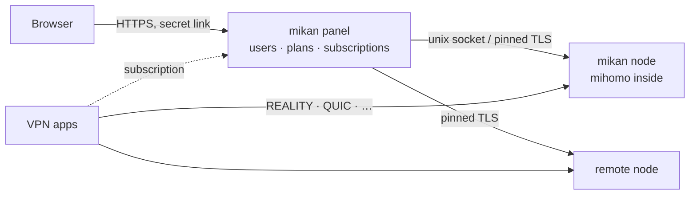

<div align="center">

<picture>
  <source media="(prefers-color-scheme: dark)" srcset=".github/assets/banner-en-dark.svg">
  
</picture>

<br>

**A fast, beautiful VPN panel on the [mihomo](https://github.com/MetaCubeX/mihomo) core — one command to install, nothing to babysit.**

[](https://miroshka000.github.io/mikan/)
[](https://github.com/Miroshka000/mikan/releases)
[](https://github.com/Miroshka000/mikan/pkgs/container/mikan)
[](LICENSE)
[](https://github.com/MetaCubeX/mihomo)
[](https://t.me/mikanvpn)
[](https://t.me/+I2JFR7DbPow1ZmQy)

**English** · [Русский](README.ru.md) · [简体中文](README.zh-CN.md) · [فارسی](README.fa.md) · [Türkçe](README.tr.md) · [Español](README.es.md)

</div>

---

## Install

On a fresh Ubuntu 22.04+ or Debian 12+ server (amd64 or arm64):

```bash
curl -fsSL https://github.com/Miroshka000/mikan/releases/latest/download/install.sh | sudo bash
```

The installer asks for the panel language and an optional domain, checks that the domain points to the server, installs Docker if needed, picks REALITY camouflage sites next to your server and prints your admin link. Run `mikan` again at any time for the management menu.

A node for an existing panel: the panel's **Nodes** page (or `mikan node add`) gives the command with its key:

```bash
curl -fsSL https://github.com/Miroshka000/mikan/releases/latest/download/install.sh | sudo bash -s -- --join KEY
```

Without questions, for scripts: `… | sudo bash -s -- --yes --lang en --domain vpn.example.com --email you@example.com` (all flags: `mikan install --help`).

## Why mikan

<table>
<tr>
<td width="50%" valign="top">

### 🛡️ Survives blocking on its own
mikan watches whether real clients still reach each protocol. When a port gets blocked on the way, it moves the protocol to a free HTTPS port; when a REALITY camouflage site stops working, it picks a new one next to your server.

</td>
<td width="50%" valign="top">

### 📱 Every app gets what it can use
Subscriptions detect the app — Happ, v2RayTun, Koala Clash, SlothClash, Clash Verge, FlClash, ClashFest, Hiddify, Shadowrocket and more — and hand it only the protocols it actually supports. No more “it doesn't work for me”.

</td>
</tr>
<tr>
<td valign="top">

### 📊 Byte-exact accounting
mihomo is embedded as a library, so traffic is counted per user on every connection — not sampled. Plans by time and gigabytes, billing days, device limits and device binding against key sharing. Since every connection is known by its user, the torrent blocker bans the one who torrents on every node, not a shared IP.

</td>
<td valign="top">

### 🤖 Telegram bot and Mini App built in
Subscribers check their plan, devices and connection guides in a bot you set up in the panel, open the subscription page as a Telegram Mini App and get notified before it expires. They can also buy and renew — Telegram Stars, cards and SBP through YooKassa, or crypto through CryptoBot — and the panel hands out the link by itself. Broadcasts respect Telegram's limits.

</td>
</tr>
<tr>
<td valign="top">

### 🪶 Light as a mandarin
Go and PostgreSQL, three small containers. On a working server with clients: **~14 MB RAM** for the panel, **~50 MB** for the database, **~40 MB** for the VPN core.

</td>
<td valign="top">

### 🔒 Locked down by default
Secret admin link on a random port, HTTPS with Let's Encrypt (even for a bare IP), argon2id, TOTP 2FA, CSRF protection, strict CSP, audit log. Containers run non-root, read-only, with all capabilities dropped.

</td>
</tr>
<tr>
<td valign="top">

### 🌐 WARP and server cascades
Each node can have its own WARP — registered in one click or from your WireGuard config — and protocols can leave through another node of the panel (client → node A → node B → internet). Chosen protocols, domains and networks take those ways out, everything else goes direct.

</td>
<td valign="top">

### 🧩 API and keys for integrations
A REST API documented right in the panel, with read-only or full-access keys for bots, billing and monitoring.

</td>
</tr>
</table>

## Promo codes

Admins can create discount codes and codes for bonus days or traffic. Subscribers apply
codes in the Telegram Mini App, which also shows their redemption history. Bonus traffic
can go to the main balance or a selected pool. Discounted invoices are available only
through payment methods that support refunds: Telegram Stars and adapters that advertise
refund support. Mikan can then return a payment if its promo reservation expires before
the provider confirms it.

## Screenshots

<table>
<tr>
<td width="50%"></td>
<td width="50%"></td>
</tr>
<tr>
<td></td>
<td></td>
</tr>
</table>

<p align="center">

&nbsp;&nbsp;

</p>

## Protocols

Seventeen protocols, each a preset with keys generated for you. The subscription gives every app only what it runs:

| Protocol | Clash apps<br><sub>mihomo core</sub> | Xray apps<br><sub>Happ, v2RayTun</sub> | sing-box apps<br><sub>Hiddify, Karing</sub> |
|---|:---:|:---:|:---:|
| VLESS · REALITY · Vision | ✅ | ✅ | ✅ |
| VLESS · REALITY · XHTTP | ✅ | ✅ | — |
| VLESS · REALITY · gRPC | ✅ | ✅ | ✅ |
| VLESS PQ (post-quantum encryption) | ✅ | ✅ | — |
| Trojan · REALITY | ✅ | ✅ | ✅ |
| VLESS · TLS · XHTTP | ✅ | ✅ | — |
| VLESS · TLS · Vision | ✅ | ✅ | ✅ |
| Hysteria2 | ✅ | ✅ | ✅ |
| TUIC v5 | ✅ | — | ✅ |
| AnyTLS | ✅ | — | ✅ |
| TrustTunnel | ✅ | — | — |
| ShadowQUIC | ✅ | — | — |
| Mieru | ✅ | — | — |
| Shadowsocks-2022 ¹ | ✅ | ✅ | ✅ |
| Sudoku ¹ | ✅ | — | — |
| Snell ¹ | ✅ | — | — |
| VMess (custom config) | ✅ | ✅ | ✅ |

<sub>¹ One key for all users in mihomo: no per-user accounting or limits on these. Newer protocols are sent to Clash apps only when their core is new enough.</sub>

## How it works



The panel and the node are two processes from one image. Update or restart the panel — VPN keeps running. Add remote nodes with a join key from the **Nodes** page.

## Managing the server

Run `mikan` for the menu, or use the commands directly:

| Command | What it does |
|---|---|
| `mikan status` | containers, versions, health, available update |
| `mikan logs [panel\|node]` | live logs |
| `mikan url` | admin link |
| `mikan reset-password` · `reset-path` · `disable-2fa` | regain access |
| `mikan update` | update now (backup first, automatic rollback) |
| `mikan backup` · `restore FILE` | backups in `/opt/mikan/backups` |
| `mikan node …` · `mikan inbound …` | nodes and protocols |
| `mikan targets scan` · `apply` | REALITY camouflage sites next to the server |
| `mikan join KEY` | on a node: take a new key from the panel |
| `mikan restart` | restart the containers |
| `mikan uninstall` | stop and remove the command, keep the data |

## Updates

The panel checks for a new release once a day and shows what changed. Turn on **auto-update** in settings, or press **Update**: the host updater pulls the image from GitHub Packages, backs up, migrates the database, restarts and rolls back if the new version does not come up healthy. Every release manifest is signed.

On 0.4.4 or older, update to 0.4.5 first; the move to 0.5 and PostgreSQL then comes through the Update button too. If you skipped 0.4.5, the install command above updates an existing server.

## Building from source

```bash
docker buildx build -t mikan:dev .            # panel + node image
cd web && pnpm install && pnpm dev            # admin UI with hot reload
MIKAN_TEST_DATABASE_URL=postgres://… go test ./...   # Go 1.27, a test PostgreSQL 18 and pg_dump
cd installer && cargo test                    # the installer (Rust)
```

Development happens on the `dev` branch; pull requests into `main` are built and tested, releases are published from tags.

## License

mikan is free software under the [GNU GPL v3](LICENSE). It embeds [mihomo](https://github.com/MetaCubeX/mihomo) (GPL-3.0). Fonts: Unbounded, Onest, JetBrains Mono (SIL OFL 1.1).

<div align="center">
<sub>Made with 🍊</sub>
</div>
