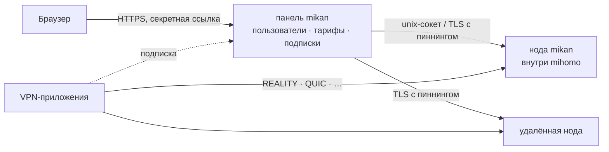

<div align="center">

<picture>
  <source media="(prefers-color-scheme: dark)" srcset=".github/assets/banner-ru-dark.svg">
  
</picture>

<br>

**Быстрая и красивая VPN-панель на ядре [mihomo](https://github.com/MetaCubeX/mihomo): ставится одной командой и не требует присмотра.**

[](https://github.com/Miroshka000/mikan/releases)
[](https://github.com/Miroshka000/mikan/pkgs/container/mikan)
[](LICENSE)
[](https://github.com/MetaCubeX/mihomo)
[](https://t.me/mikanvpn)
[](https://t.me/+I2JFR7DbPow1ZmQy)

[English](README.md) · **Русский** · [简体中文](README.zh-CN.md) · [فارسی](README.fa.md) · [Türkçe](README.tr.md) · [Español](README.es.md)

</div>

---

## Установка

На чистом сервере с Ubuntu 22.04+ или Debian 12+ (amd64 или arm64):

```bash
curl -fsSL https://github.com/Miroshka000/mikan/releases/latest/download/install.sh | sudo bash
```

Установщик по шагам:
1. Спрашивает язык панели и, если нужно, домен. Проверяет, что домен указывает на этот сервер.
2. Ставит Docker, если его нет.
3. Подбирает сайты для маскировки REALITY рядом с сервером.
4. В конце выдаёт ссылку на админку.

Меню управления потом открывается командой `mikan`.

Нода для уже работающей панели: страница **Ноды** в панели (или `mikan node add`) выдаёт команду с ключом:

```bash
curl -fsSL https://github.com/Miroshka000/mikan/releases/latest/download/install.sh | sudo bash -s -- --join КЛЮЧ
```

Без вопросов, для скриптов: `… | sudo bash -s -- --yes --lang ru --domain vpn.example.com --email you@example.com` (все флаги: `mikan install --help`).

## Почему mikan

<table>
<tr>
<td width="50%" valign="top">

### 🛡️ Сама переживает блокировки
mikan следит, доходят ли реальные клиенты до каждого протокола:
- если по дороге заблокировали порт, панель переносит протокол на свободный HTTPS-порт;
- если сайт маскировки REALITY перестал подходить, подбирает новый рядом с сервером.

</td>
<td width="50%" valign="top">

### 📱 Каждому приложению — то, что работает
Подписка узнаёт приложение: Happ, v2RayTun, Koala Clash, SlothClash, Clash Verge, FlClash, ClashFest, Hiddify, Shadowrocket и другие. Каждому она отдаёт только те протоколы, которые оно умеет. Никаких «у меня не работает».

</td>
</tr>
<tr>
<td valign="top">

### 📊 Учёт до байта
mihomo встроен как библиотека, поэтому трафик считается по каждому соединению каждого пользователя, а не выборочно.
- Тарифы по сроку и гигабайтам, день оплаты.
- Лимит устройств и привязка к устройствам против перепродажи ключа.
- Блокировка торрентов: каждое соединение известно по пользователю, поэтому бан получает тот, кто качает, сразу на всех нодах, а не общий IP.

</td>
<td valign="top">

### 🤖 Telegram-бот и Mini App внутри
Бот настраивается прямо в панели. В нём подписчики:
- видят тариф, устройства и инструкции;
- открывают страницу подписки как Mini App;
- получают напоминания до конца срока;
- покупают и продлевают подписку: Telegram Stars, карта или СБП через ЮKassa, криптовалюта через CryptoBot — панель выдаёт ссылку сама.

Рассылки идут с учётом лимитов Telegram.

</td>
</tr>
<tr>
<td valign="top">

### 🪶 Лёгкая, как мандарин
Go и PostgreSQL, три небольших контейнера. На рабочем сервере с клиентами:
- панель — **~14 МБ ОЗУ**;
- база — **~50 МБ ОЗУ**;
- ядро VPN — **~40 МБ ОЗУ**.

</td>
<td valign="top">

### 🔒 Закрыта по умолчанию
- Секретная ссылка на админку на случайном порту.
- HTTPS с Let's Encrypt, даже для голого IP.
- Пароли на argon2id, 2FA (TOTP), защита от CSRF, строгий CSP, журнал аудита.
- Контейнеры без root, только для чтения, со сброшенными привилегиями.

</td>
</tr>
<tr>
<td valign="top">

### 🌐 WARP и каскад серверов
У каждой ноды может быть свой WARP — регистрация в один клик или свой WireGuard-конфиг, — а подключения могут выходить через другую ноду панели (клиент → нода A → нода B → интернет). Выбранные подключения, домены и сети идут этими путями, остальное — напрямую.

</td>
<td valign="top">

### 🧩 API и ключи для интеграций
REST API с документацией прямо в панели, ключи с правами «только чтение» или «полный доступ» для ботов, биллинга и мониторинга.

</td>
</tr>
</table>

## Промокоды

Администратор может создавать скидочные промокоды и коды на бонусные дни или трафик.
Подписчики активируют их в Telegram Mini App и видят историю активаций. Бонусный трафик
можно начислить в основной баланс или выбранный пул. Скидочные счета доступны только
через способы оплаты с поддержкой возврата: Telegram Stars и адаптеры, которые заявили
такую возможность. Тогда Mikan сможет вернуть оплату, если резерв промокода истёк до
подтверждения платежа провайдером.

## Скриншоты

<table>
<tr>
<td width="50%"></td>
<td width="50%"></td>
</tr>
<tr>
<td></td>
<td></td>
</tr>
</table>

<p align="center">

&nbsp;&nbsp;

</p>

## Протоколы

Семнадцать протоколов, для каждого есть готовый пресет, ключи генерируются сами. Подписка отдаёт каждому приложению только то, что оно запускает:

| Протокол | Clash-приложения<br><sub>ядро mihomo</sub> | Приложения на Xray<br><sub>Happ, v2RayTun</sub> | Приложения на sing-box<br><sub>Hiddify, Karing</sub> |
|---|:---:|:---:|:---:|
| VLESS · REALITY · Vision | ✅ | ✅ | ✅ |
| VLESS · REALITY · XHTTP | ✅ | ✅ | — |
| VLESS · REALITY · gRPC | ✅ | ✅ | ✅ |
| VLESS PQ (постквантовое шифрование) | ✅ | ✅ | — |
| Trojan · REALITY | ✅ | ✅ | ✅ |
| VLESS · TLS · XHTTP | ✅ | ✅ | — |
| VLESS · TLS · Vision | ✅ | ✅ | ✅ |
| Hysteria2 | ✅ | ✅ | ✅ |
| TUIC v5 | ✅ | — | ✅ |
| AnyTLS | ✅ | — | ✅ |
| TrustTunnel | ✅ | — | — |
| ShadowQUIC | ✅ | — | — |
| Mieru | ✅ | — | — |
| Shadowsocks-2022 ¹ | ✅ | ✅ | ✅ |
| Sudoku ¹ | ✅ | — | — |
| Snell ¹ | ✅ | — | — |
| VMess (свой конфиг) | ✅ | ✅ | ✅ |

<sub>¹ В mihomo у этих протоколов один ключ на всех, поэтому учёта и лимитов по пользователям на них нет. Новые протоколы Clash-приложение получает, только если его ядро достаточно свежее.</sub>

## Как это устроено



Панель и нода — два процесса из одного образа. Обновление или перезапуск панели не роняет VPN. Удалённые ноды добавляются по ключу со страницы **Ноды**.

## Управление сервером

Команда `mikan` открывает меню. Команды можно вызывать и напрямую, они на английском:

| Команда | Что делает |
|---|---|
| `mikan status` | контейнеры, версии, состояние, доступное обновление |
| `mikan logs [panel\|node]` | логи в реальном времени |
| `mikan url` | ссылка на админку |
| `mikan reset-password` · `reset-path` · `disable-2fa` | вернуть доступ |
| `mikan update` | обновить сейчас: сначала бэкап, при сбое откат |
| `mikan backup` · `restore FILE` | бэкапы в `/opt/mikan/backups` |
| `mikan node …` · `mikan inbound …` | ноды и протоколы |
| `mikan targets scan` · `apply` | сайты для маскировки REALITY рядом с сервером |
| `mikan join КЛЮЧ` | на ноде: взять новый ключ из панели |
| `mikan restart` | перезапустить контейнеры |
| `mikan uninstall` | остановить и удалить команду, данные остаются |

## Обновления

Панель раз в день проверяет новый релиз и показывает, что изменилось. Автообновление включается в настройках, обновиться сразу можно кнопкой **Обновить**.

Обновление делает программа на хосте:
1. Берёт образ из GitHub Packages.
2. Делает бэкап.
3. Обновляет базу и перезапускает панель.
4. Если новая версия не поднялась, откатывается.

Манифест каждого релиза подписан.

На 0.4.4 и более ранних версиях сначала обновитесь до 0.4.5, тогда переход на 0.5 с PostgreSQL тоже пройдёт кнопкой. Пропустили 0.4.5 — подойдёт команда из «Установки», она обновит существующий сервер.

## Сборка из исходников

```bash
docker buildx build -t mikan:dev .            # образ панели и ноды
cd web && pnpm install && pnpm dev            # админка с горячей перезагрузкой
MIKAN_TEST_DATABASE_URL=postgres://… go test ./...   # Go 1.27, тестовая PostgreSQL 18 и pg_dump
cd installer && cargo test                    # установщик (Rust)
```

Разработка идёт в ветке `dev`. Пулл-реквесты в `main` собираются и проходят тесты, релизы публикуются по тегам.

## Лицензия

mikan — свободная программа под [GNU GPL v3](LICENSE). Внутри [mihomo](https://github.com/MetaCubeX/mihomo) (GPL-3.0). Шрифты: Unbounded, Onest, JetBrains Mono (SIL OFL 1.1).

<div align="center">
<sub>Сделано с 🍊</sub>
</div>
