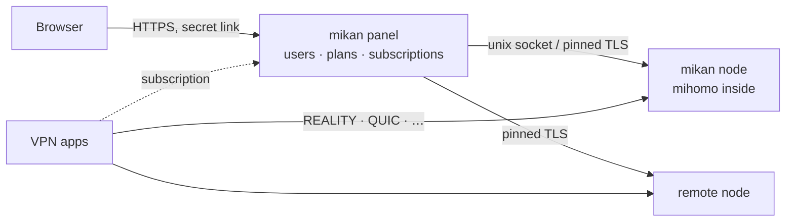

<div align="center">

<picture>
  <source media="(prefers-color-scheme: dark)" srcset=".github/assets/banner-en-dark.svg">
  
</picture>

<br>

**[mihomo](https://github.com/MetaCubeX/mihomo) çekirdeği üzerinde hızlı ve güzel bir VPN paneli: tek komutla kurulur, başında beklemek gerekmez.**

[](https://github.com/Miroshka000/mikan/releases)
[](https://github.com/Miroshka000/mikan/pkgs/container/mikan)
[](LICENSE)
[](https://github.com/MetaCubeX/mihomo)
[](https://t.me/mikanvpn)
[](https://t.me/+I2JFR7DbPow1ZmQy)

[English](README.md) · [Русский](README.ru.md) · [简体中文](README.zh-CN.md) · [فارسی](README.fa.md) · **Türkçe** · [Español](README.es.md)

</div>

---

## Kurulum

Yeni bir Ubuntu 22.04+ veya Debian 12+ sunucuda (amd64 veya arm64):

```bash
curl -fsSL https://github.com/Miroshka000/mikan/releases/latest/download/install.sh | sudo bash
```

Kurulum betiği panel dilini ve isteğe bağlı bir alan adını sorar, alan adının sunucuyu gösterdiğini kontrol eder, gerekirse Docker'ı kurar, sunucunuzun yakınında REALITY kamuflaj siteleri seçer ve yönetici bağlantınızı yazdırır. Yönetim menüsü için `mikan` komutunu istediğiniz zaman yeniden çalıştırabilirsiniz.

Mevcut bir panele düğüm eklemek için: panelin **Düğümler** sayfası (veya `mikan node add`) anahtarıyla birlikte komutu verir:

```bash
curl -fsSL https://github.com/Miroshka000/mikan/releases/latest/download/install.sh | sudo bash -s -- --join KEY
```

Soru sormadan, betikler için: `… | sudo bash -s -- --yes --lang en --domain vpn.example.com --email you@example.com` (tüm bayraklar: `mikan install --help`).

## Neden mikan

<table>
<tr>
<td width="50%" valign="top">

### 🛡️ Engellemeden kendi başına kurtulur
mikan, gerçek istemcilerin her protokole hâlâ ulaşıp ulaşamadığını izler. Bir port yolda engellendiğinde protokolü boş bir HTTPS portuna taşır; bir REALITY kamuflaj sitesi çalışmayı bırakırsa sunucunuzun yakınında yenisini seçer.

</td>
<td width="50%" valign="top">

### 📱 Her uygulama kullanabildiğini alır
Abonelikler uygulamayı tanır (Happ, v2RayTun, Koala Clash, SlothClash, Clash Verge, FlClash, ClashFest, Hiddify, Shadowrocket ve diğerleri) ve ona yalnızca gerçekten desteklediği protokolleri verir. “Bende çalışmıyor” dönemi bitti.

</td>
</tr>
<tr>
<td valign="top">

### 📊 Bayt hassasiyetinde sayım
mihomo bir kütüphane olarak gömülüdür, bu yüzden trafik her bağlantıda kullanıcı bazında sayılır, örneklenmez. Süreye ve gigabayta göre planlar, faturalama günleri, cihaz sınırları ve anahtar paylaşımına karşı cihaz bağlama.

</td>
<td valign="top">

### 🤖 Telegram botu ve Mini App dahili
Aboneler planlarını, cihazlarını ve bağlantı rehberlerini panelde kurduğunuz bir botta kontrol eder, abonelik sayfasını Telegram Mini App olarak açar ve süre dolmadan önce bildirim alır. Satın alma ve yenileme de yapabilirler: Telegram Stars, YooKassa üzerinden kartlar ve SBP veya CryptoBot ile kripto. Bağlantıyı panel kendisi verir. Toplu mesajlar Telegram'ın sınırlarına uyar.

</td>
</tr>
<tr>
<td valign="top">

### 🪶 Mandalina kadar hafif
Go ve PostgreSQL, üç küçük konteyner. İstemcileri olan çalışan bir sunucuda: panel için **~14 MB RAM**, veritabanı için **~50 MB**, VPN çekirdeği için **~40 MB**.

</td>
<td valign="top">

### 🔒 Varsayılan olarak kilitli
Rastgele bir portta gizli yönetici bağlantısı, Let's Encrypt ile HTTPS (çıplak IP için bile), argon2id, TOTP ile iki adımlı doğrulama, CSRF koruması, sıkı CSP, denetim günlüğü. Konteynerler root olmadan, salt okunur çalışır ve tüm capabilities yetkileri düşürülmüştür.

</td>
</tr>
<tr>
<td valign="top">

### 🌐 WARP ve sunucu kaskadları
Her düğümün kendi WARP'ı olabilir: tek tıkla veya WireGuard yapılandırmanızdan kaydedilir. Protokoller panelin başka bir düğümü üzerinden de çıkabilir (istemci → düğüm A → düğüm B → internet). Seçilen protokoller, alan adları ve ağlar bu yolları kullanır, geri kalan her şey doğrudan gider.

</td>
<td valign="top">

### 🧩 Entegrasyonlar için API ve anahtarlar
Doğrudan panelde belgelenmiş bir REST API. Botlar, faturalama ve izleme için salt okunur veya tam erişimli anahtarlar.

</td>
</tr>
</table>

## Promosyon kodları

Yöneticiler indirim kodları ile bonus gün veya trafik kodları oluşturabilir. Aboneler
kodları Telegram Mini App'te kullanır, uygulama kullanım geçmişini de gösterir. Bonus
trafik ana bakiyeye ya da seçilen bir havuza eklenebilir. İndirimli faturalar yalnızca
iade destekleyen ödeme yöntemleriyle ödenebilir: Telegram Stars ve iade desteği bildiren
adaptörler. Böylece sağlayıcı ödemeyi onaylamadan promosyon rezervasyonunun süresi dolarsa
Mikan ödemeyi iade edebilir.

## Ekran görüntüleri

<table>
<tr>
<td width="50%"></td>
<td width="50%"></td>
</tr>
<tr>
<td></td>
<td></td>
</tr>
</table>

<p align="center">

&nbsp;&nbsp;

</p>

## Protokoller

On yedi protokol, her biri sizin için üretilmiş anahtarlarla hazır bir ön ayar. Abonelik her uygulamaya yalnızca çalıştırabildiğini verir:

| Protokol | Clash uygulamaları<br><sub>mihomo çekirdeği</sub> | Xray uygulamaları<br><sub>Happ, v2RayTun</sub> | sing-box uygulamaları<br><sub>Hiddify, Karing</sub> |
|---|:---:|:---:|:---:|
| VLESS · REALITY · Vision | ✅ | ✅ | ✅ |
| VLESS · REALITY · XHTTP | ✅ | ✅ | — |
| VLESS · REALITY · gRPC | ✅ | ✅ | ✅ |
| VLESS PQ (kuantum sonrası şifreleme) | ✅ | ✅ | — |
| Trojan · REALITY | ✅ | ✅ | ✅ |
| VLESS · TLS · XHTTP | ✅ | ✅ | — |
| VLESS · TLS · Vision | ✅ | ✅ | ✅ |
| Hysteria2 | ✅ | ✅ | ✅ |
| TUIC v5 | ✅ | — | ✅ |
| AnyTLS | ✅ | — | ✅ |
| TrustTunnel | ✅ | — | — |
| ShadowQUIC | ✅ | — | — |
| Mieru | ✅ | — | — |
| Shadowsocks-2022 ¹ | ✅ | ✅ | ✅ |
| Sudoku ¹ | ✅ | — | — |
| Snell ¹ | ✅ | — | — |
| VMess (özel yapılandırma) | ✅ | ✅ | ✅ |

<sub>¹ mihomo'da tüm kullanıcılar için tek anahtar vardır: bu protokollerde kullanıcı bazında sayım ve sınır yoktur. Yeni protokoller Clash uygulamalarına yalnızca çekirdekleri yeterince yeniyse gönderilir.</sub>

## Nasıl çalışır



Panel ve düğüm, aynı imajdan çalışan iki işlemdir. Paneli güncelleyin veya yeniden başlatın, VPN çalışmaya devam eder. **Düğümler** sayfasından bir katılma anahtarıyla uzak düğümler ekleyin.

## Sunucuyu yönetme

Menü için `mikan` komutunu çalıştırın veya komutları doğrudan kullanın:

| Komut | Ne yapar |
|---|---|
| `mikan status` | konteynerler, sürümler, sağlık durumu, mevcut güncelleme |
| `mikan logs [panel\|node]` | canlı günlükler |
| `mikan url` | yönetici bağlantısı |
| `mikan reset-password` · `reset-path` · `disable-2fa` | erişimi geri kazanma |
| `mikan update` | şimdi güncelle (önce yedek, otomatik geri alma) |
| `mikan backup` · `restore FILE` | yedekler `/opt/mikan/backups` içinde |
| `mikan node …` · `mikan inbound …` | düğümler ve protokoller |
| `mikan targets scan` · `apply` | sunucunun yakınındaki REALITY kamuflaj siteleri |
| `mikan join KEY` | düğümde: panelden yeni bir anahtar al |
| `mikan restart` | konteynerleri yeniden başlat |
| `mikan uninstall` | durdur ve komutu kaldır, veriyi koru |

## Güncellemeler

Panel günde bir kez yeni sürüm olup olmadığına bakar ve nelerin değiştiğini gösterir. Ayarlarda **otomatik güncellemeyi** açın veya **Güncelle**'ye basın: sunucudaki güncelleyici imajı GitHub Packages'tan çeker, yedek alır, veritabanını taşır, yeniden başlatır ve yeni sürüm sağlıklı şekilde ayağa kalkmazsa geri alır. Her sürüm manifestosu imzalıdır.

0.4.4 veya daha eskisindeyseniz önce 0.4.5'e güncelleyin. 0.5'e ve PostgreSQL'e geçiş de ardından Güncelle düğmesiyle gelir. 0.4.5'i atladıysanız yukarıdaki kurulum komutu mevcut bir sunucuyu günceller.

## Kaynaktan derleme

```bash
docker buildx build -t mikan:dev .            # panel + node image
cd web && pnpm install && pnpm dev            # admin UI with hot reload
MIKAN_TEST_DATABASE_URL=postgres://… go test ./...   # Go 1.27, a test PostgreSQL 18 and pg_dump
cd installer && cargo test                    # the installer (Rust)
```

Geliştirme `dev` dalında yapılır. `main` dalına açılan çekme istekleri derlenir ve test edilir, sürümler etiketlerden yayımlanır.

## Lisans

mikan, [GNU GPL v3](LICENSE) altında özgür yazılımdır. İçine [mihomo](https://github.com/MetaCubeX/mihomo) (GPL-3.0) gömülüdür. Yazı tipleri: Unbounded, Onest, JetBrains Mono (SIL OFL 1.1).

<div align="center">
<sub>🍊 ile yapıldı</sub>
</div>
