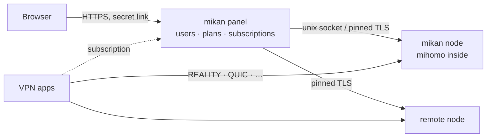

<div align="center">

<picture>
  <source media="(prefers-color-scheme: dark)" srcset=".github/assets/banner-en-dark.svg">
  
</picture>

<br>

**基于 [mihomo](https://github.com/MetaCubeX/mihomo) 内核的 VPN 面板：快速、好看，一条命令安装，无需照看。**

[](https://github.com/Miroshka000/mikan/releases)
[](https://github.com/Miroshka000/mikan/pkgs/container/mikan)
[](LICENSE)
[](https://github.com/MetaCubeX/mihomo)
[](https://t.me/mikanvpn)
[](https://t.me/+I2JFR7DbPow1ZmQy)

[English](README.md) · [Русский](README.ru.md) · **简体中文** · [فارسی](README.fa.md) · [Türkçe](README.tr.md) · [Español](README.es.md)

</div>

---

## 安装

在全新的 Ubuntu 22.04+ 或 Debian 12+ 服务器上（amd64 或 arm64）：

```bash
curl -fsSL https://github.com/Miroshka000/mikan/releases/latest/download/install.sh | sudo bash
```

安装程序会询问面板语言和可选的域名，检查域名是否指向本服务器，按需安装 Docker，在服务器附近挑选 REALITY 伪装站点，并输出管理员链接。之后随时再运行 `mikan` 即可打开管理菜单。

为已有面板添加节点：在面板的 **节点** 页面（或用 `mikan node add`）获取带密钥的命令：

```bash
curl -fsSL https://github.com/Miroshka000/mikan/releases/latest/download/install.sh | sudo bash -s -- --join KEY
```

脚本中可免交互安装：`… | sudo bash -s -- --yes --lang en --domain vpn.example.com --email you@example.com`（全部参数见 `mikan install --help`）。

## 为什么选择 mikan

<table>
<tr>
<td width="50%" valign="top">

### 🛡️ 自动应对封锁
mikan 会检查真实客户端是否仍能连上各个协议。端口在途中被封时，它会把协议换到空闲的 HTTPS 端口；REALITY 伪装站点失效时，它会在服务器附近重新挑选一个。

</td>
<td width="50%" valign="top">

### 📱 每个应用拿到它能用的
订阅会识别客户端应用，如 Happ、v2RayTun、Koala Clash、SlothClash、Clash Verge、FlClash、ClashFest、Hiddify、Shadowrocket 等，只下发它真正支持的协议。再也没有“我这里用不了”。

</td>
</tr>
<tr>
<td valign="top">

### 📊 精确到字节的计量
mihomo 以库的形式嵌入，所以每个连接的流量都按用户统计，而不是抽样。支持按时间和 GB 的套餐、计费天数、设备数量限制，以及防止共享密钥的设备绑定。

</td>
<td valign="top">

### 🤖 内置 Telegram 机器人和 Mini App
订阅用户可以在你于面板中设置的机器人里查看套餐、设备和连接指南，把订阅页面作为 Telegram Mini App 打开，并在到期前收到通知。他们还可以自行购买和续费：通过 Telegram Stars、YooKassa 的银行卡和 SBP，或通过 CryptoBot 用加密货币，面板会自动发放链接。群发消息遵守 Telegram 的限制。

</td>
</tr>
<tr>
<td valign="top">

### 🪶 像橘子一样轻
Go 和 PostgreSQL，三个小容器。在带客户端的实际运行服务器上：面板约 **14 MB** 内存，数据库约 **50 MB**，VPN 内核约 **40 MB**。

</td>
<td valign="top">

### 🔒 默认即加固
随机端口上的秘密管理员链接，Let's Encrypt 的 HTTPS（纯 IP 也支持），argon2id，TOTP 双因素认证，CSRF 防护，严格的 CSP，审计日志。容器以非 root 用户只读运行，并丢弃所有 capabilities。

</td>
</tr>
<tr>
<td valign="top">

### 🌐 WARP 与服务器级联
每个节点都可以有自己的 WARP，一键注册或使用你的 WireGuard 配置；协议还可以经由面板中的另一个节点出口（客户端 → 节点 A → 节点 B → 互联网）。选定的协议、域名和网络走这些出口，其余流量直连。

</td>
<td valign="top">

### 🧩 面向集成的 API 与密钥
面板内置完整的 REST API 文档，并提供只读或完全访问的密钥，供机器人、计费和监控使用。

</td>
</tr>
</table>

## 优惠码

管理员可以创建折扣码，以及赠送天数或流量的奖励码。订阅用户在 Telegram Mini App 中使用
优惠码，这里也会显示兑换记录。奖励流量可以计入主余额，也可以计入指定的流量池。带折扣的账单
只能通过支持退款的支付方式支付：Telegram Stars，以及声明支持退款的适配器。这样，如果优惠码的预留
在支付服务商确认之前过期，mikan 就能把款项退回。

## 截图

<table>
<tr>
<td width="50%"></td>
<td width="50%"></td>
</tr>
<tr>
<td></td>
<td></td>
</tr>
</table>

<p align="center">

&nbsp;&nbsp;

</p>

## 协议

十七种协议，每种都是预设，密钥自动生成。订阅只给每个应用下发它能运行的协议：

| 协议 | Clash 类应用<br><sub>mihomo 内核</sub> | Xray 类应用<br><sub>Happ, v2RayTun</sub> | sing-box 类应用<br><sub>Hiddify, Karing</sub> |
|---|:---:|:---:|:---:|
| VLESS · REALITY · Vision | ✅ | ✅ | ✅ |
| VLESS · REALITY · XHTTP | ✅ | ✅ | — |
| VLESS · REALITY · gRPC | ✅ | ✅ | ✅ |
| VLESS PQ（后量子加密） | ✅ | ✅ | — |
| Trojan · REALITY | ✅ | ✅ | ✅ |
| VLESS · TLS · XHTTP | ✅ | ✅ | — |
| VLESS · TLS · Vision | ✅ | ✅ | ✅ |
| Hysteria2 | ✅ | ✅ | ✅ |
| TUIC v5 | ✅ | — | ✅ |
| AnyTLS | ✅ | — | ✅ |
| TrustTunnel | ✅ | — | — |
| ShadowQUIC | ✅ | — | — |
| Mieru | ✅ | — | — |
| Shadowsocks-2022 ¹ | ✅ | ✅ | ✅ |
| Sudoku ¹ | ✅ | — | — |
| Snell ¹ | ✅ | — | — |
| VMess（自定义配置） | ✅ | ✅ | ✅ |

<sub>¹ 在 mihomo 中所有用户共用一个密钥，因此这些协议没有按用户的计量和限制。较新的协议只会在 Clash 类应用的内核足够新时才下发给它们。</sub>

## 工作原理



面板和节点是同一个镜像里的两个进程。更新或重启面板时，VPN 不会中断。通过 **节点** 页面的加入密钥可以添加远程节点。

## 管理服务器

运行 `mikan` 打开菜单，或直接使用命令：

| 命令 | 作用 |
|---|---|
| `mikan status` | 容器、版本、健康状态、可用更新 |
| `mikan logs [panel\|node]` | 实时日志 |
| `mikan url` | 管理员链接 |
| `mikan reset-password` · `reset-path` · `disable-2fa` | 找回访问权限 |
| `mikan update` | 立即更新（先备份，失败自动回滚） |
| `mikan backup` · `restore FILE` | 备份存放在 `/opt/mikan/backups` |
| `mikan node …` · `mikan inbound …` | 节点和协议 |
| `mikan targets scan` · `apply` | 服务器附近的 REALITY 伪装站点 |
| `mikan join KEY` | 在节点上执行：从面板获取新密钥 |
| `mikan restart` | 重启容器 |
| `mikan uninstall` | 停止并删除该命令，保留数据 |

## 更新

面板每天检查一次新版本，并显示更新内容。在设置中开启 **自动更新**，或点击 **更新**：宿主机上的更新程序会从 GitHub Packages 拉取镜像、备份、迁移数据库并重启，如果新版本没有正常启动，则自动回滚。每个发布清单都有签名。

如果是 0.4.4 或更早版本，请先更新到 0.4.5；之后升级到 0.5 和 PostgreSQL 同样通过“更新”按钮完成。如果你跳过了 0.4.5，上面的安装命令可以更新已有的服务器。

## 从源码构建

```bash
docker buildx build -t mikan:dev .            # panel + node image
cd web && pnpm install && pnpm dev            # admin UI with hot reload
MIKAN_TEST_DATABASE_URL=postgres://… go test ./...   # Go 1.27, a test PostgreSQL 18 and pg_dump
cd installer && cargo test                    # the installer (Rust)
```

开发在 `dev` 分支进行；合并到 `main` 的拉取请求会被构建和测试，发布版本由标签生成。

## 许可证

mikan 是基于 [GNU GPL v3](LICENSE) 的自由软件，内嵌 [mihomo](https://github.com/MetaCubeX/mihomo)（GPL-3.0）。字体：Unbounded、Onest、JetBrains Mono（SIL OFL 1.1）。

<div align="center">
<sub>用 🍊 制作</sub>
</div>
